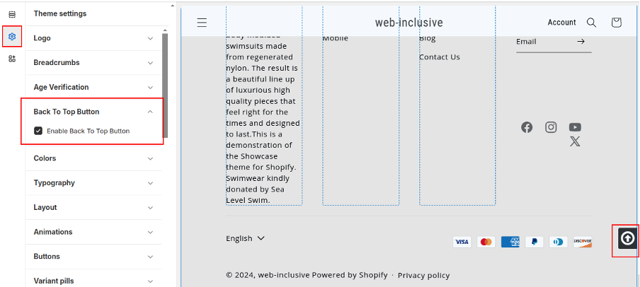
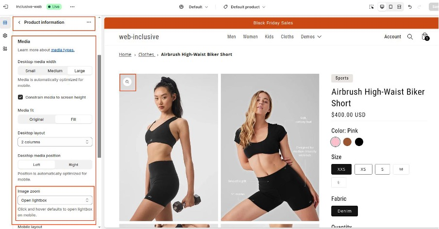
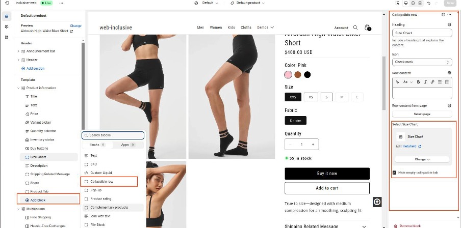

# InclusiVista Theme Documentation

Documentation for the InclusiVista Shopify Theme by AFixt.

## Introduction and Overview

The InclusiVista Shopify Theme was created to provide Shopify store owners the ability to ensure that their website is ADA compliant while also being attractive and supporting a broad array of Shopify features without needing to install 3rd party apps.

## Accessibility Note

This theme has been tested by independent accessibility experts, including testers with disabilities, against a checklist of nearly 270 check items, using a robust testing methodology.  That said, it is up to both the implementer of the theme and the store owner to ensure accessibility of the final store and its content. One of the quickest ways to create accessibility problems is to modify the colors with colors that have insufficient contrast. A [number of tools exist](https://www.google.com/search?q=chrome+webstore+accessibility+color+tools) to check your color contrast. We strongly recommend diligently checking the contrast of your final implementation.

Throughout this documentation we will make numerous notes and recommendations regarding the accessibility of the features in the theme. Please be sure to read them.

If you have any accessibility comments or concerns, email inclusivista@afixt.com

## Features

Note: a fair number of these features requires the use of [Custom Metadata](https://help.shopify.com/en/manual/custom-data/overview).

### Age Verifier

Ensures users confirm their age before entering the store (useful for age-restricted products). When users visit your site for the first time, they will be prompted with a confirmation dialog asking "Are you 18 or older?". If the user selects "Yes," they will be redirected to the site. If "No" is selected, they will be unable to proceed.

To Enable the Age Verifier and Change the text message, go to 'Theme Setting' -> 'Age Verification'

### 'Back to Top' Button

Allows users to quickly return to the top of the page. When users scroll down, a small button will appear in the bottom right corner of the page. Clicking this button will smoothly scroll the user back to the top of the page.

To enable or disable the Back to Top Button, go to 'Theme Settings' -> 'Back to Top'

### Breadcrumbs

Shows the user's navigation path within the site for easy backtracking.

To enable/disable or change the text message, go to 'Theme Setting' -> 'Breadcrumbs'

### Colour Swatches

Displays available product colors as clickable options. To use this feature, you must use [variants](https://help.shopify.com/en/manual/products/variants) for your products

### Countdown Timer

Creates urgency by displaying time left for promotions or sales. To support this, our theme contains a section to display a countdown timer. In this section, you can enable and disable the countdown and specify the message you want to show and the date and time until which the countdown will be displayed.

To add. go to theme customization, then add a 'Countdown Timer' section.

### Translations

Currently the theme offers translations for key European languages: (EN, FR, IT, DE, ES)

To add or edit translations, go to 'Settings' -> 'Languages'

### In-menu Promos

Displays promotions within the navigation menu. This feature shows banner images on a 'Mega Menu' Drop Down.

To modify/ add this, to go 'Section' -> 'Header' -> 'Upload Image'. There, you will be able to add an image and a link.

### Infinite Scroll

Automatically loads more products as the user scrolls down.  

By Default Infinite Scroll is enabled. Some accessibility advocates tend to dislike infinie scroll. So, we've added the option to use a 'Load More' button instead, which will allow users to avoid infinite scroll and be in control of when to load more content on

Enable/ disable the 'Load More' button at: 'Theme Settings' -> 'Infinite Scroll' -> 'Enable Load More Button'

### Mega Menu

Expands navigation menus to show multiple categories at once. This theme supports mega menus.

Menus are located at 'Online Store' -> 'Navigation' -> 'Menu'.

To configure it as a Mega Menu go to 'Online Store' -> 'Theme' -> 'Customize' -> 'Sections' -> 'Header' and select 'Desktop menu type'

### Quick View

Allows users to preview product details without leaving the page.  

This adds a 'Quick View' button on category page product cards. Using this button, users can see some product details on the category page.

To enable/ disable this and modify its settings, go to: 'Collection page' -> 'Section' -> 'Product Grid' -> 'Theme Settings' -> 'Quick View'

### Stock Counter

Shows how many items are left in stock.  

To enable or disable, go to 'Template' -> 'Product Information' -> 'Section' -> 'Product Information' -> 'Inventory Status'

### Store Locator

Helps users find physical store locations.  

To use this feature, you will need a [Google Maps API Key](https://developers.google.com/maps/documentation/embed/get-api-key). To add your key, go to 'pages', then select 'store-locator'. There, you can save your Google API Key and default map zoom level

While on that page, you can also add your store locations. In the 'Template' section, under 'Store Locator' you can hit 'Add Store' to save the addresses of your stores.

Note: Latitude and Longitude are required. [How to get them](https://support.google.com/maps/answer/18539)

### Sticky Header

Keeps the header and navigation bar visible while scrolling.  

To enable/ disable Sticky Header, go to 'Sections' -> 'Header' -> 'Sticky header'

Note: using a sticky header may cause accessibility problems for users with certain vision impairments. Some users browse the web with very low resolution on desktop computers. Using a sticky header will mean some portion of the screen will always be taken up by the header (which is the point).  The problem is, the taller your sticky header, the more likely content outside of the sticky header will be hard to see.  We've ensured that the header on this theme is, by default, easy to use. Be careful if customizing the theme, however, so that you don't cause it to become too tall.

### Cart Notes

Allows customers to add notes to their cart (e.g., special instructions).  

To enable Cart Notes, go to theme settings, then 'Cart'. Inside cart settings, you can enable 'cart notes'.

### Gift Wrapping

Offers gift wrapping options during checkout. This theme contains a feature to add gift wrap as a product.

This setting allows customers to select gift wrapping for a product they wish to give as a gift. The admin can create a dummy product to be used as the gift wrap. When the customer selects this product, it will be added to the cart, notifying the seller that the customer has also requested gift wrapping.

To enable/ disable this feature, go to 'Theme Settings -> 'Cart' -> 'Enable Cart Gift'

### In-store Pickups

Lets customers choose in-store pickup as a delivery option.  

To set up stores for In-store pickups, go to 'Settings' ->  'Shipping and delivery' -> 'Pickup in store' -> 'Set up'

### Pre-order

Allows customers to order products that are not yet available.  

**This requires the use of custom metafields**. To create this, go to 'Settings' -> 'Custom Data' -> 'Products' -> 'Add Definitions' -> 'Name': "Pre-order" | 'Namespace and key': `custom.pre_order` | 'Type':  "True or False"

Once the above is done, to add a pre-Order button  in product settings:

* Select 'Pre-Order' as "True"
* Enable 'Track quantity'
* Enable 'Continue selling when out of stock'

Once the above steps are complete, a Pre-Order Button will show when a product is out of stock.

### Quick Buy

Simplifies the buying process by allowing immediate purchase from product listings. This is enabled by default.

To enable/ disable this, go to 'Sections' -> 'Product Grid' -> 'Product Card' -> 'Quick Add'.

Note: Using both "Quick View" and "Quick Buy" at the same time tends to clutter up the product cards and adds a bit of nuisance to the UI for people browsing with screen readers. If given the choice, we'd recommend Quick Buy over Quick View, but that often depends on the type of products you sell and whether your store focuses mostly on cross-sells. 

### Slide-out Cart

Displays the shopping cart in a side panel without leaving the current page.  

To enable/ disable this, go to 'Theme Settings' -> 'Cart' -> 'Cart Type' -> 'Drawer'

### Product Badges

Highlights products with labels like "New" or "Sale."  

**This requires the use of custom metafields**. To create this, go to 'Settings' -> 'Custom Data' -> 'Products' -> 'Add 'Definitions -> 'Name':"Badges" | 'Namespace and key': `custom.badges` | 'Type': "Single line text" -> Select: "One Value"

To enable Badges:

* Go to 'Product settings'
* Select 'Product' and scroll down to 'Product metafields'
* Select 'Badges' and write in the text which you want to show as a badge.

### Sticky Cart

Keeps the shopping cart visible while users browse the store.  When enabled, when users add products by the 'Add to cart' button the cart shows

To enable, go to theme customization, then 'Cart'. Under 'Cart Type':

* Select 'Drawer Notification' as cart type to enable both drawer and sticky cart
* Select 'Drawer' if you want to show sticky cart only.

### Blogs

This theme supports Shopify's default blogs, giving you a platform for creating content to engage customers.  

Add posts by going to your store's Admin area, then -> 'Online Store' -> 'Blog posts' -> 'Add blog post'

### FAQ Page

Provides answers to common customer questions.  

To add an FAQ Page :

* go to Theme Customization, then select 'Pages' -> select 'FAQ'
* Add blocks:
  * Category (Title)
  * Question ( Question and Answer)

### Promo Banners

Displays promotional messages or offers across the site. The theme supports a 'Promo Banner' section, which you can manage through the customization settings.

To Add the 'Promo Banner' section, go to theme customization. Then you can add a promo banner in any section like 'Header', 'Template' and 'Footer'. Then to add the section, select 'Promo Banner'.

To Enable the 'Promo Banner' section go to 'Promo Banner', then select 'Enable Popup'

To customize the 'Promo Banner' use the following available settings:

* Add Promo Image
* Popup Text
* Background Color
* Text Color
* Button Text
* Button Link
* When to Display Banner:
  * If you select "Refresh Popup Notification", it will appear again the next time a user views that page
  * If you select "One-Time Popup Notification", it will appear only one time (unless the user clears their cookies)

### Promo Tiles

Highlights promotions using clickable images.  

You can manage 'Promo Tiles' through the customization settings.

To add the 'Promo Tiles' section, go to theme customization. You can add 'Promo Tiles' to any section like 'Header', 'Template' and 'Footer'. Then to add the section, select 'Promo Tiles'.

By default 'Promo Tiles' is disabled after adding the section of the promo tiles.

To enable the 'Promo Tiles' section, go to the template you want to customize, then Sections, then add a new Section and select "Promo Tiles"

### Recently Viewed

Shows users a list of products they've recently looked at.  

This theme includes a 'Recently Viewed' section, which you can manage within theme customization.

To add the 'Recently Viewed' section to the product page go to Theme -> Customize. You can add this section in 'Template' -> 'Add Section'. Then select "Recently Viewed"

### Recommended Products

Suggests additional products based on customer behavior.  

This theme includes a 'Recommended Products' section, which you can manage within theme customization.

To add the 'Recently Viewed' section to the product page go to Theme -> Customize. You can add this section in 'Template' -> 'Add Section'. Then select "Recommended Products"

### Payment Icons

Displays accepted payment methods (e.g., credit cards, PayPal).  

This theme includes a section for displaying Payment Icons.  To manage, go to theme customization, then to -> Footer -> Payment methods. From there, select the payment icons to show.

### Trust Badges

Provides visual cues to assure customers of secure and trustworthy shopping.  

To Add Trust badges go to 'Theme Settings' -> 'Section' -> 'Add Section' -> 'Trust Badge'.

You can add image and text in these badges.

### Image Hotspot

Image hotspots are interactive points on an image that display product details or info.  

To manage, go to theme customization.

* There, you can add a section, 'Tooltips'
* Inside 'Tooltips' settings, you can add a main image and other settings
* Inside the 'Tooltips' section there is 'Tooltip Title' Block where you can add the product to show when the tooltip is clicked.

#### Accessibility

In general, these are a difficult feature to get accessible for all users and, as a result, this isn't a feature we recommend using due to the inherent difficulties some people may have in finding them.

When creating the tooltips, be sure to manage the color for the tooltip to ensure that it provides sufficient color contrast.

### Image Rollover

Changes the product image when hovering over it.  

To add 'Image Rollover' :

* Go to theme customization, then select 'collections' -> 'Default collection'.
* Then go to 'Template' section -> 'Product grid'

Once there, go to 'Product card'. There, you can enable 'Show second Image on hover'.

### Image Galleries

Allows users to browse multiple images of a product.  

To add an image gallery:

* Go to theme customization, then select 'Products' -> 'Default products'.
* Once there, go to 'Template' section -> 'Product Information'.

To enable or set different types of 'image galleries':

* Go to 'Product Information'  -> 'Media' -> 'Desktop layout', then select '2 columns'.

### Image Zoom

Enables users to zoom in on product images for a closer look.  

To add 'Image Zoom', go to theme customization, then select 'Products' -> 'Default products'.
From there, go to 'Template' section -> 'Product Information'.

To enable or set different types of 'image galleries', go to 'Product Information'  -> 'Media'

From there, go to 'Image zoom' and select 'Open lightbox'.

### Lookbooks

Displays curated collections of products in a stylish, magazine-like format.  

To add, go to theme customization. From there, you  can add this section in any section like 'Header', 'Template' and 'Footer'. Then, Add Section and Select 'Lookbooks'.

By default 'Lookbooks' is disabled after adding the section of the 'Lookbooks'.

Once you enable the Lookbooks, you can add multiple images and products following these steps:

* Go to 'Lookbook section' > 'Add Block'
* Add 'Image'
* Add 'Product'.

### Product Tabs

Organizes product information into tabbed sections.  

**This requires the use of custom metafields**. To set them up, you must go to Settings -> 'Custom Data' -> Products -> Add Definitions -> "Name": 'product_tabs' | "Namespace and key": 'custom.product_tabs' | "Type":  'Metaobject' -> Select: 'List of entries'.

Now to add 'Product Tab'  in product settings:

* Select Product and scroll down to 'Product metafields'
* Select 'product_tabs' and add 'tabs' which you want to show on the product page.

To Customize the 'Product Tab' :

* Go to theme customization and select 'Product' -> 'Default product'.
* From there, go to 'Template' -> 'Product Information' -> 'Add Block' -> 'Product Tab'

### Product Videos

Embeds videos to showcase products in more detail.

To add 'Product videos' :

* Go to theme customization, then select 'Products' -> 'Default products'.
* From there, go to 'Template' section -> 'Product Information'.

### Size Chart

Provides a guide to product sizing (e.g., clothing measurements).  

**This requires the use of custom metafields**. To create this, go to Settings -> 'Custom Data' -> Products -> Add Definitions -> "Name": 'Size Chart' | "Namespace and key" `custom.size_chart` | "Type":  'File' -> Select: 'One file'.

To Show the 'Size Chart' image in a collapsible area:

* Go to 'theme customization' -> select 'Products' -> 'Default products'.
* Go to 'Template' -> 'Product Information'.
* 'Add block' then Add 'Collapsible row'  -> Select Size Chart -> Connect with dynamic source -> Row content from page -> select 'Product' -> select 'Size Chart'.

To Show a 'Size Chart' image directly on product page:

* Go to theme customization, then select 'Products' -> 'Default products'.
* Go to 'Template' section -> 'Product Information'.
* 'Add block' and select 'File Block'.
* Click on Connect with dynamic source -> select 'Size Chart'.

This will directly show the product size chart image.

### Product Filtering and Sorting

Allows users to filter and sort products by various attributes.  

To add 'Product filtering and sorting':

* Go to 'theme customization' > select 'collections' > 'Default collection'.
* From there, go to 'Template' section -> 'Product grid'

To Enable 'Product filtering and sorting', go to 'Product grid' -> 'Product card' -> 'Filtering and sorting'. From there you can select 'Enable filtering' and/ or 'Enable sorting'

### Cross-selling

Suggests complementary products to increase sales.  

To add 'Cross-selling', go to 'theme customization' and select 'Cart'. Then go to 'Template' section ->  'Add Section' -> 'Featured Collection'.

### Customizable Contact Form

Provides a form for customer inquiries, customizable for specific needs.  

To add a customizable contact form, go to theme customization, then select 'Page'. From there, select 'contact'
-> 'Template' section -> 'Add Section' -> 'Contact form with text'. Here you can create dynamically field and add texts as needed.

### Slideshow

Displays rotating images or promotions.  

To add slideshow, go to theme customization, then 'Template' section ->  'Add Section' -> Add 'Slideshow'.

To add an image to the slideshow, go to 'slideshow' -> 'Add Slide'

### Product Rating

Shows customer ratings for each product.

This theme supports, product ratings, but that doing so requires an app. Our official recommendation for an accessible product rating app is [Judge.me](https://apps.shopify.com/judgeme)

## Ensuring Accessibility of your Shopify Store

While this theme is built to be accessible and has been tested to ensure accessibility, there are still a few things to be mindful of as you customize and manage your site:

### Third party apps are the source of many accessibility problems

An unfortunate reality when it comes to the Shopify ecosystem is that most developers of third party apps do not seem to know (or care) about accessibility. As accessibility consultants, we've seen countless cases where third party apps have serious and egregious accessibility problems.  Just like you verify that an app fits your business needs, you should always verify the accessibility of any app before installing it.

### Understand the use of text alternatives for images

Another frequent concern when it comes to accessibility is to ensure that you have sufficient text alternatives for images. Doing so effectively is a bit more of an art than a science when it comes to online stores. Each image should have an informative text alternative. The W3C has an excellent set of [tutorials](https://www.w3.org/WAI/tutorials/images/) for this. We recommend developing a practice of providing deeply informative product descriptions as well as clear text alternatives.

### Do not leave your accessibility to a "widget" or overlay

Some online stores tend to believe that adding accessibility plugins will make their store accessible. Unfortunately, this is untrue.  Nearly 900 accessibility experts across the world have endorsed a factsheet against these products. Read more at [Overlay Factsheet](https://overlayfactsheet.com/en/)
